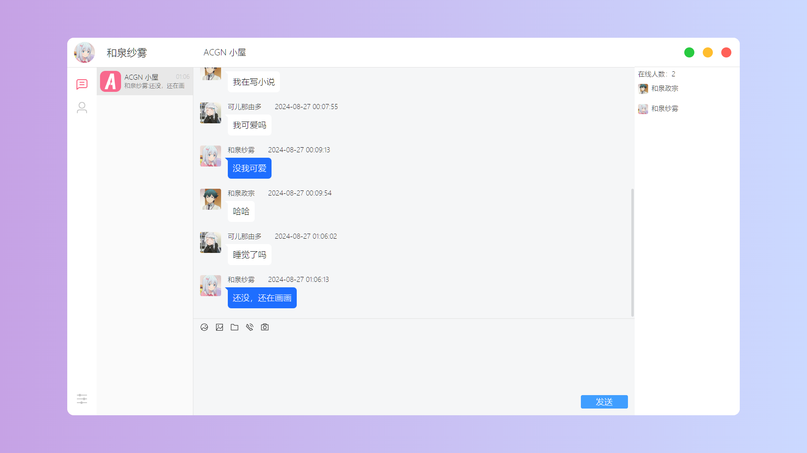

# Fast-Chat-X-Client-Python


名称：Fast-Chat-X / 极聊X

作者：KSaMar

日期：2024/08/25 - 2024/08/27

描述：一个在线的即时聊天网页聊天室

点我去服务端：[服务端](https://github.com/baobaoJK/Fast-Chat-X-Server-Python)


## 开发环境

开发软件：VS Code

Node 版本：18.16.0

### 技术栈

项目采用以下技术：

Vue3 + Scss + TypeScript + Element-Plus + Axios + SocketIO


## 项目介绍

采用 Vue3 + SocketIO 的即时在线多人聊天室网页项目（客户端）

功能模块：用户登录、用户注册、用户忘记密码、群聊等（未来会弄更多）

可以发送文本 / 符号表情与 emoji 表情 😊

消息可以存取到数据库中


### 账号密码

| 用户名     | 账号  | 密码   |
| ---------- | ----- | ------ |
| 和泉纱雾   | 10001 | 123456 |
| 和泉政宗   | 10002 | 123456 |
| 古河渚     | 10003 | 123456 |
| 冈崎朋也   | 10004 | 123456 |
| 小鸟游六花 | 10005 | 123456 |
| 富樫勇太   | 10006 | 123456 |
| 可儿那由多 | 10007 | 123456 |
| 羽岛伊月   | 10008 | 123456 |


## 项目图片

### 用户登录


### 用户注册


### 用户忘记密码


### 聊天框



### 目前完成的功能


## 项目流程图


## 项目部署

下载此项目进入目录输入

```bash
pnpm install
pnpm format
pnpm run dev
```


## Bilibili

欢迎在哔哩哔哩上关注我

[Bilibili](https://space.bilibili.com/51110915)
